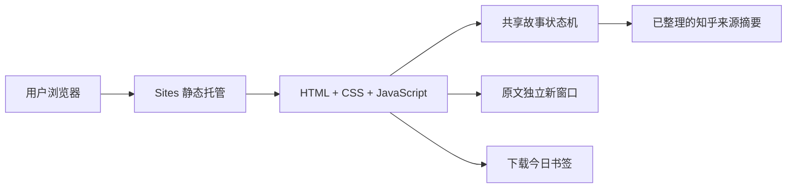

# 1.2 落地路线与技术说明

## 用户实际体验

开书 → 入学 → 探索 → 大三准备 → 毕业 → 回望与今天的书签。每个阶段先做剧情选择，再选择一条知乎内容。原文链接独立于单选框。来源选择决定带入下一阶段的问题，并保存在本次路径记录中。

本版有 7 条去重来源、每节点 3–4 条参考、8 种毕业情境。节点情境由产品编排；参考内容可能是个人自述或建议。分支不模拟概率，不保证某次行动得到某个录取或职业结果。

## 公网架构（已经发布）

公网没有运行时 Agent，浏览器不持有知乎或模型凭证。选择只存在本次页面会话中，刷新会重新开始；书签输入只在本机生成下载文件。静态内容是确定性编排，不冒充实时 AI，也不把开发时的研究子代理算作产品 Agent。

## 前后端联调（本地已经可运行）

`npm run dev` 运行 Node.js 同源服务，同时提供前端页面和 `/api/story/*`。后端在内存保存会话，前端发送当前节点、版本号和事件，后端校验后返回新视图。两端共享 `frontend/story.mjs`，保证规则一致。接口细节见 `API.md`。

| 文件 | 用途 |
|---|---|
| frontend/index.html + styles.css | 书页视觉、进度、卡片、回顾和手机适配 |
| frontend/app.mjs | DOM 渲染、单选交互、请求锁定、错误提示和下载 |
| frontend/content.mjs | 人工复核的来源、剧情节点与结局 |
| frontend/story.mjs | 节点与事件校验、路径记录、承接问题 |
| backend/server.mjs | 同源 JSON API、会话隔离、请求体限制、过期控制 |
| scripts/build.mjs | 只将 7 个公开文件复制到 dist |

公网 Sites 当前只发布 `dist/` 静态文件，Node 后端没有随之上线。正式接入需要将服务器逻辑部署到受支持的 Worker 或独立后端；不能把 Node 的 http.listen 入口直接当 Worker。正式共享会话还需持久化、限流和会话权限。

## 下一轮：一个有出处的内容助手

优先做单个内容助手，暂不堆叠多 Agent：

1. 输入当前节点、所选来源、用户想追问的问题。
2. 后端调用知乎搜索，筛选相关经历；热榜用于发现确实相关的当前议题。
3. 必要时调用知乎直答，生成简短解读、一个可尝试动作，并返回引用。
4. 程序校验来源 ID、链接与摘要，限制篇幅、请求频率和额度，缓存重复请求。
5. 失败时明确显示“预整理内容”，不把降级结果伪装为实时回答。

开发时已通过官方 CLI 获取素材；当前网站操作不会发起付费模型调用。后续接入仅使用已确认的比赛平台凭证；不能以代理数量或调用次数代替 AI 场景价值。

## 本轮验证

`npm test` 的 5 项测试覆盖来源必选与替换、8 种结局、4 节连续性、无效事件与过期版本、会话隔离及 API。`tests/ui-smoke.mjs` 以本地安装的 Playwright 对静态与 API 两种模式实际点击完整流程，检查独立原文链接、来源更换、承接问题、结尾、下载、重新开始和 390px 手机宽度无横向溢出。原文新窗口的网络请求在回归中被拦截，测试验证跳转行为，不代表已逐个验证知乎页面的公网可访问性。

## 1.2 封面交接

`frontend/cover.mjs` 仅负责封面光线与开场转场，不包含节点规则。`styles.css` 末尾的 1.2 cover 区域集中控制封面样式，`index.html` 的 intro 区域为封面结构。正文结构不需跟随封面改动；谭一凡、王涵硕可自行分工深化交互与视觉。此轮没有引入图片生成、WebGL 或新 API 费用。

## Agent 放置与响应策略（下一轮）

### 为什么只用一个 Agent

当前四节点引导是规则驱动的交互叙事引擎，不是 Agent。Agent 的职责应该限定为“有出处的知乎经历向导”。一开始拆成检索 Agent、叙事 Agent、审核 Agent 会增加延迟、额度消耗和现场解释成本；一个 Agent 加后端校验足够证明 AI 场景价值。

### 放在哪个节点

默认放在 **探索节点的来源选择页**：用户先做剧情选择，再选一条知乎内容，然后主动点击“问问这段经历”。入学页先保持确定性开场，避免评委等待；大三准备可以复用同一个 Agent，作为第二次可选调用；毕业结局继续由预设分叉保证稳定。每次体验最多两次调用，路演只演示探索节点一次。

### 输入与输出

输入固定为：`stage_id`、`choice_id`、`source_id`、`carry_question`，以及用户可选的一句追问。输出固定为 JSON：

- `interpretation`：一句基于来源的解读；
- `gain`：可能得到什么；
- `cost`：可能付出或承担什么；
- `small_step`：一个低成本尝试；
- `next_question`：带进下一节点的问题；
- `citations`：2–3 个经过后端允许的知乎来源 ID、标题和原文链接。

Agent 只组织有出处的内容，不改变节点、不生成概率、不预测录取或就业结果，也不把作者自述改写成普遍规律。节点跳转、来源选择、会话历史和八种毕业情境仍由 `story.mjs` 状态机负责。

### 如何做到快

用户选来源时不自动调用；点击“问问这段经历”才调用。后端先查缓存，缓存键为 `stage_id + source_id + question_hash`；命中立即返回。未命中时只做一次知乎搜索，最多取 2–3 条候选，必要时再调用直答，要求模型返回短 JSON。前端显示立即可见的“正在整理这段经历”，超过短超时就展示团队预整理的得到/付出/下一步，并标注“团队预整理”；不会让用户卡在空白页面。

后端必须校验来源 ID 和知乎域名、限制输出长度、去重和频率，并为每个会话设置额度预算。浏览器不持有 Access Secret 或模型密钥。这样产品在路演时可用缓存或预置结果快速响应，真实落地时也保留实时 Agent 的入口。
